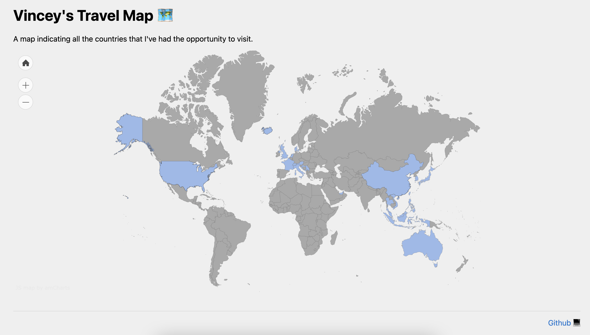

# countries

This repo hosts a static page of all the countries I've visited. 

I created it using [AmCharts](https://www.amcharts.com/visited_countries/), then re-factored it into the [ideal website structure](https://developer.mozilla.org/en-US/docs/Learn/Getting_started_with_the_web/Dealing_with_files#what_structure_should_your_website_have).



## Notes on flexbox

CSS has always seemed to be a big, fat mystery to me, but now I understand flexbox a little better.

The key to making this page non-scrollable (i.e. all the bits are squished into the viewport) is this:

```css
.box {
  /* Use fancy flexbox. This makes the div element the flex container, and its children flex items. */
  display: flex;  
  /* The default flex-direction is horizontal. However, I am trying to modify the vertical heights of my elements (top heading, map, footer). */
  flex-direction: column; 
  /* The box class makes up my entire page, and I'd like my entire page to take up 100%. */
  height: 100%;
}
```

From there, we can control how the flex items use the extra space with 3 properties:

1. `flex-grow` (default: 0)

    `flex-grow` indicates how much the given flex item will grow to fill any extra vertical (in my case) space. The default value of 0 means that will not grow. 

    For my top text div and footer, I leave `flex-grow` to be implicitly 0, as I do not want them to take any extra space.

    However, I set `#map` to have `flex-grow: 1;`. The number itself doesn't matter; I could have done `flex-grow: 23984293;` and it would behave exactly the same way. This is because the value is a proportion with every other flex item.

    Since this is the only flex item with a non-zero `flex-grow`, the map div will fill up the remaining space.

1. `flex-shrink` (default: 1)

    `flex-shrink` indicates the ratio at which each flex item will shrink (less than the `flex-basis`), _if_ there are too many flex items to fit into the flex container (box class div).

    We have plenty space, so there's no need to worry about this property in this project.

1. `flex-basis` (default: auto)

    `flex-basis` defines the initial size of the item. `auto` means that the browser will first see if the item has a size set (e.g. 100px), and if not, it will simply take as much space as it needs to display their contexts. 

    We do not set the size on any of our 3 flex items, so by default, they are their content's size.


One final interesting thing is a comparison of several ways we can define `#map`. The following result in the page looking the same:


```CSS
/* Example 1 */
#map {
  flex-grow: 1;
}

/* Example 2 */
#map {
  width: 100%;
  flex-grow: 1;
}

/* Example 3 */
#map {
  width: 100%;
  height: 100%;
}

/* Example 4 */
#map {
  height: 100%;
}
```

Examples 1 and 2 are equivalent, and examples 3 and 4 as well. The `width: 100%` property is implicitly applied, because when we make a flex container, the flex items will [stretch to fill the size of the cross axis](https://developer.mozilla.org/en-US/docs/Web/CSS/CSS_Flexible_Box_Layout/Basic_Concepts_of_Flexbox#the_flex_container). In this case, we set the axis to vertical, so our cross axis is horizontal.

However, example 1 and 4 are not the same. In example 1, the map div grows to fill the remaining space, whereas in example 4, the map div's `flex-basis` actually sets its size to 100% of the viewport. It is the default setting `flex-shrink: 1` which enables the map to shrink such that all elements fit onto the page. 

If we do:

```CSS
#map {
  height: 100%;
  flex-shrink: 0;
}
```

Then, no element can shrink anymore, so the page ends up being larger than the viewport, and scrolling is necessary.